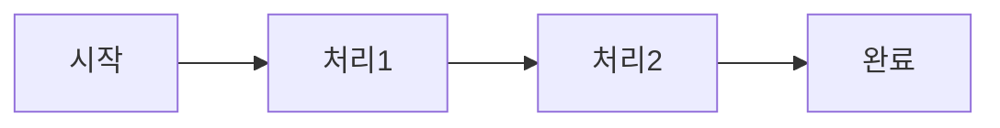

# 학습 자료 내용 추출 및 작성 프롬프트 (범용 템플릿)

## 사용법

이 프롬프트를 사용하기 전에 아래 **[설정 섹션]**을 작업할 주제에 맞게 수정하세요.

---

## [설정 섹션] - 주제별 커스터마이징

### 기본 설정

```yaml
# 주제 정보
SUBJECT_CODE: "DS"                    # 예: DS, AI, SEC, NW, SW, DB
SUBJECT_NAME: "Digital Service"       # 예: AI (인공지능), 보안, 네트워크, 소프트웨어공학, 데이터베이스
SUBJECT_NAME_KR: "디지털서비스"        # 한글 주제명

# 경로 설정
IMAGE_PATH: "/Users/jaewoo.ryu/woowa/dev/jwryu87.github.io/assets/jpeg/{{SUBJECT_CODE}}/"
MARKDOWN_PATH: "/Users/jaewoo.ryu/woowa/dev/jwryu87.github.io/docs/{{SUBJECT_CODE_LOWER}}/"

# 이미지 파일명 패턴
IMAGE_PREFIX: "{{SUBJECT_CODE}}_"     # 예: DS_, AI_, SEC_
IMAGE_START_NUM: 1                    # 시작 번호
IMAGE_END_NUM: 100                    # 끝 번호 (예상)
```

### 카테고리 구조 (주제별로 정의)

```yaml
# 예시: AI 주제
categories:
  - code: "01-ml-basics"
    name: "머신러닝 기초"
    topics: ["지도학습", "비지도학습", "강화학습"]
  - code: "02-deep-learning"
    name: "딥러닝"
    topics: ["CNN", "RNN", "Transformer"]
  # ... 추가 카테고리
```

---

## 작업 목표

**{{SUBJECT_NAME}}** 학습 자료의 PDF 이미지에서 내용을 추출하여 Jekyll 마크다운 파일에 구조화된 형식으로 작성합니다.

---

## 작업 진행 상황 템플릿

```markdown
## 현재 진행 상황
- ✅ 완료: [완료된 토픽 수]개 토픽
- ⏳ 진행 중: [진행 중인 토픽]
- 📁 이미지 위치: `{{IMAGE_PATH}}`
- 📁 마크다운 위치: `{{MARKDOWN_PATH}}`
```

---

## 작업 방법

### 1. 이미지 읽기

```python
# 예시: 4개씩 배치로 읽기
read_file("assets/jpeg/{{SUBJECT_CODE}}/{{SUBJECT_CODE}}_001.jpg")
read_file("assets/jpeg/{{SUBJECT_CODE}}/{{SUBJECT_CODE}}_002.jpg")
read_file("assets/jpeg/{{SUBJECT_CODE}}/{{SUBJECT_CODE}}_003.jpg")
read_file("assets/jpeg/{{SUBJECT_CODE}}/{{SUBJECT_CODE}}_004.jpg")
```

### 2. 내용 추출 및 구조화

이미지에서 다음 정보를 추출:

| 추출 항목 | 설명 | 필수 여부 |
|:---------|:-----|:---------|
| **핵심 키워드** | 주요 기술 용어들 | ✅ 필수 |
| **정의/개념** | 토픽의 핵심 정의 | ✅ 필수 |
| **특징/기술요소** | 표 형식으로 정리 | ✅ 필수 |
| **구성요소** | 아키텍처, 메커니즘 등 | ⭕ 있으면 |
| **암기법(두음매직)** | 암기 도우미 | ⭕ 있으면 |
| **비교표** | 다른 기술과의 비교 | ⭕ 있으면 |
| **수식/알고리즘** | 수학 공식, 알고리즘 | ⭕ 있으면 |
| **다이어그램 설명** | 구조도, 흐름도 | ⭕ 있으면 |

### 3. 마크다운 파일 작성 형식

#### 기본 구조

```markdown
---
layout: default
title: [토픽명]
parent: [카테고리명]
grand_parent: {{SUBJECT_NAME}}
nav_order: [순서]
---

# [토픽명]
{: .fs-8 }

[소분류] (예: 1.1 머신러닝 기초)
{: .label .label-purple }

> 암기: **[두음매직]** (있는 경우)

---

## 핵심 키워드

`키워드1` `키워드2` `키워드3`

---

## 정의/개념

[핵심 정의]

---

## [주요 섹션]

[표 형식으로 정리]

---

## 연계 토픽

- [관련 토픽](/docs/{{SUBJECT_CODE_LOWER}}/...)

---

## 학습 체크리스트

- [ ] 개념 이해
- [ ] 핵심 키워드 암기
- [ ] 실무 적용 사례 파악

---

## 참고자료

- 정보관리기술사 {{SUBJECT_NAME}} 학습자료
```

#### 표 작성 규칙

- **구분/카테고리** 컬럼은 첫 번째 컬럼
- **설명** 컬럼은 마지막에 배치
- 복잡한 내용은 `<br>`로 줄바꿈
- 예시:

```markdown
| 구분 | 요소 | 설명 |
|:-----|:-----|:-----|
| **특징** | 복제성 | 물리 모델을 사이버에 그대로 구현 |
```

#### 수식 작성 규칙 (AI/수학 관련 토픽)

```markdown
<!-- 인라인 수식 -->
손실 함수는 $L = -\sum y \log(\hat{y})$ 로 정의됩니다.

<!-- 블록 수식 -->
$$
\text{Attention}(Q, K, V) = \text{softmax}\left(\frac{QK^T}{\sqrt{d_k}}\right)V
$$
```

---

## 파일명 매핑 규칙

- 이미지 번호와 실제 토픽 파일명은 다를 수 있음
- 이미지 내용을 보고 적절한 파일을 찾아야 함
- 파일명은 **영문 소문자, 하이픈(-)** 사용
- 예시:
  - "합성곱 신경망" → `docs/ai/02-deep-learning/cnn.md`
  - "방화벽" → `docs/sec/03-network-security/firewall.md`
  - "정규화" → `docs/db/04-modeling/normalization.md`

---

## 라벨 색상 가이드

| 색상 | 용도 | 예시 |
|:-----|:-----|:-----|
| `.label-purple` | 기본 토픽/핵심 개념 | 머신러닝, 암호화 |
| `.label-green` | 활용/서비스/응용 | 추천시스템, SSO |
| `.label-yellow` | 기술/표준/프로토콜 | TLS, OAuth |
| `.label-blue` | 이론/개념/원리 | 베이즈 정리, 정규화 |
| `.label-red` | 보안/위험/주의 | 취약점, 공격기법 |

---

## 주제별 카테고리 템플릿

### AI (인공지능)

```
docs/ai/
├── 01-ml-basics/          # 머신러닝 기초
├── 02-deep-learning/      # 딥러닝
├── 03-nlp/                # 자연어처리
├── 04-computer-vision/    # 컴퓨터 비전
├── 05-reinforcement/      # 강화학습
├── 06-generative/         # 생성형 AI
├── 07-mlops/              # MLOps
├── 08-ethics/             # AI 윤리
├── 09-applications/       # AI 응용
└── 10-trends/             # AI 트렌드
```

### SEC (보안)

```
docs/sec/
├── 01-crypto/             # 암호학
├── 02-authentication/     # 인증/인가
├── 03-network-security/   # 네트워크 보안
├── 04-app-security/       # 애플리케이션 보안
├── 05-cloud-security/     # 클라우드 보안
├── 06-threat/             # 위협/공격
├── 07-compliance/         # 컴플라이언스
├── 08-incident/           # 사고대응
├── 09-privacy/            # 개인정보보호
└── 10-security-arch/      # 보안 아키텍처
```

### NW (네트워크)

```
docs/nw/
├── 01-fundamentals/       # 네트워크 기초
├── 02-protocols/          # 프로토콜
├── 03-routing/            # 라우팅
├── 04-switching/          # 스위칭
├── 05-wireless/           # 무선 네트워크
├── 06-cloud-network/      # 클라우드 네트워크
├── 07-sdn/                # SDN/NFV
├── 08-monitoring/         # 네트워크 관리/모니터링
└── 09-emerging/           # 신기술
```

### SW (소프트웨어공학)

```
docs/sw/
├── 01-sdlc/               # 소프트웨어 개발 생명주기
├── 02-requirements/       # 요구사항
├── 03-design/             # 설계
├── 04-architecture/       # 아키텍처
├── 05-testing/            # 테스팅
├── 06-quality/            # 품질관리
├── 07-agile/              # 애자일/DevOps
├── 08-maintenance/        # 유지보수
└── 09-trends/             # SW 트렌드
```

### DB (데이터베이스)

```
docs/db/
├── 01-fundamentals/       # DB 기초
├── 02-sql/                # SQL
├── 03-design/             # DB 설계
├── 04-modeling/           # 데이터 모델링
├── 05-optimization/       # 튜닝/최적화
├── 06-nosql/              # NoSQL
├── 07-distributed/        # 분산 DB
├── 08-bigdata/            # 빅데이터
└── 09-data-governance/    # 데이터 거버넌스
```

---

## 작업 순서

1. **설정 확인**: 주제별 설정값 확인/수정
2. **디렉토리 생성**: 카테고리 구조에 맞게 폴더 생성
3. **이미지 읽기**: 4개씩 배치로 읽기
4. **내용 추출**: 각 이미지에서 내용 추출
5. **파일 매핑**: 해당하는 마크다운 파일 찾기/생성
6. **내용 작성**: 구조화된 형식으로 작성
7. **검토/커밋**: 4개 완료 후 커밋 (선택사항)

---

## 커밋 메시지 형식

```bash
git add docs/
git commit -m "Content: {{SUBJECT_CODE}} 토픽 N개 추가 ([카테고리명])

- [토픽1]
- [토픽2]
- [토픽3]
..."
```

---

## 주의사항

1. **파일명 확인**: 이미지 내용을 보고 정확한 파일을 찾아야 함
2. **링크 경로**: 연계 토픽 링크는 `/docs/{{SUBJECT_CODE_LOWER}}/...` 형식으로 작성
3. **표 형식**: 복잡한 내용도 표로 구조화
4. **암기법**: "두음매직"이 있으면 반드시 포함
5. **수식**: AI/수학 관련 토픽은 LaTeX 수식 포함
6. **일관성**: 같은 주제 내에서 용어, 형식 통일
7. **교차 참조**: 다른 주제와 연관된 토픽은 연계 토픽에 추가

---

## 시작 명령어 템플릿

```python
# 다음 이미지들 읽기 (번호 수정 필요)
read_file("assets/jpeg/{{SUBJECT_CODE}}/{{SUBJECT_CODE}}_001.jpg")
read_file("assets/jpeg/{{SUBJECT_CODE}}/{{SUBJECT_CODE}}_002.jpg")
read_file("assets/jpeg/{{SUBJECT_CODE}}/{{SUBJECT_CODE}}_003.jpg")
read_file("assets/jpeg/{{SUBJECT_CODE}}/{{SUBJECT_CODE}}_004.jpg")
```

그리고 각각의 내용을 추출하여 해당 마크다운 파일에 작성하세요.

---

## 주제별 설정 예시

### 예시 1: AI 주제 설정

```yaml
SUBJECT_CODE: "AI"
SUBJECT_NAME: "AI (인공지능)"
SUBJECT_NAME_KR: "인공지능"
IMAGE_PATH: "/Users/jaewoo.ryu/woowa/dev/jwryu87.github.io/assets/jpeg/AI/"
MARKDOWN_PATH: "/Users/jaewoo.ryu/woowa/dev/jwryu87.github.io/docs/ai/"
IMAGE_PREFIX: "AI_"
```

### 예시 2: 보안 주제 설정

```yaml
SUBJECT_CODE: "SEC"
SUBJECT_NAME: "보안"
SUBJECT_NAME_KR: "정보보안"
IMAGE_PATH: "/Users/jaewoo.ryu/woowa/dev/jwryu87.github.io/assets/jpeg/SEC/"
MARKDOWN_PATH: "/Users/jaewoo.ryu/woowa/dev/jwryu87.github.io/docs/sec/"
IMAGE_PREFIX: "SEC_"
```

---

## 부록: 자주 사용하는 마크다운 패턴

### 비교표

```markdown
| 구분 | A | B | C |
|:-----|:--|:--|:--|
| **특징1** | 내용 | 내용 | 내용 |
| **특징2** | 내용 | 내용 | 내용 |
```

### 계층 구조

```markdown
### 상위 개념

#### 1. 하위 개념 1
- 세부 항목
- 세부 항목

#### 2. 하위 개념 2
- 세부 항목
```

### 프로세스/흐름

```markdown

```

### Callout/강조

```markdown
{: .highlight }
> 중요한 내용을 강조할 때 사용

{: .warning }
> 주의사항을 표시할 때 사용

{: .note }
> 참고 정보를 표시할 때 사용
```

